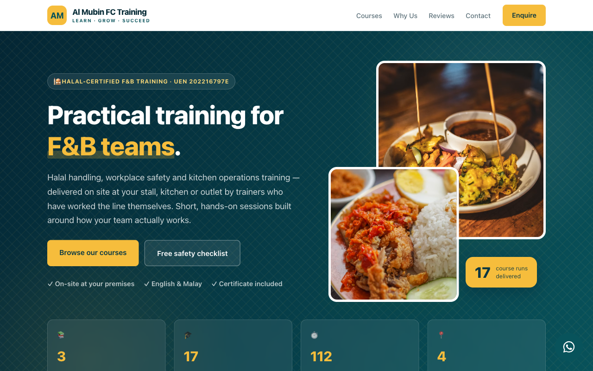

# almubin

Static marketing and course website for **Al Mubin FC Training** — Al Mubin Food Corner Pte. Ltd.
(UEN 202216797E) — delivering on-site halal handling, workplace safety and kitchen operations
training to F&B teams in Singapore.

**Live:** https://almubinfctraining.com.sg



## Stack

Plain HTML + CSS + vanilla JavaScript. No database, no framework, no runtime dependencies.
Pages are pre-generated by a small Python script and served as static files.

Hosted on **Coolify** (Static build pack, nginx) at `72.61.151.123`, behind Traefik with a
Let's Encrypt certificate. Pushing to `main` deploys automatically — see [CI/CD](#cicd).

## Structure

| Path | Purpose |
|---|---|
| `index.html` | Homepage — hero, courses, why-us, testimonials, lead magnet, contact *(generated)* |
| `courses/` | One detail page per course *(generated)* |
| `css/style.css` | Design system: teal + songket-gold, Malay-heritage motifs |
| `js/enquiry.js` | Enquiry and lead-capture form submission |
| `build/courses_data.py` | **Single source of content** — courses, fees, schedules, testimonials, contact |
| `build/build_site.py` | Page generator |
| `robots.txt`, `sitemap.xml` | Search-engine directives |
| `.github/workflows/deploy.yml` | Auto-deploy to Coolify on push |

### Editing content

`index.html` and `courses/*.html` are **generated — do not hand-edit them.** Change
`build/courses_data.py`, then rebuild:

```bash
python3 build/build_site.py
```

The generator writes the homepage and every course page, and removes pages whose slug is no
longer listed in `COURSES`. Python 3, no dependencies.

CSS and JS are hand-maintained — edit `css/style.css` and `js/enquiry.js` directly.

## Courses

| Code | Course | Duration | Fee |
|---|---|---|---|
| `AMFC-WS01` | Workplace Safety & Accident Prevention for the F&B Industry | 8 hours | S$280 |
| `AMFC-HL01` | Halal Handling & Internal Halal SOP | 8 hours | S$280 |
| `AMFC-KO01` | Manage Operations and Production Levels in Kitchen | 8 hours | S$380 |
| `AMFC-FS01` | Food Safety and Hygiene (Internal SOP Training) | 8 hours | S$280 |
| `AMFC-SL01` | Supervisor & Team Leadership | 8 hours | S$380 |
| `AMFC-BH01` | Beverage Handling | 8 hours | S$280 |
| `AMFC-TC01` | Takeaway and Counter Services | 8 hours | Free (Pro-Bono) |

### Information disclosure (SWDA)

A Training Provider must disclose, on its website or brochures: course title, training
duration, fees, funding validity period, modes of training, course objectives, the names
of senior management and trainers, the organisation structure, and the facilities &
equipment used to conduct training.

Each course page carries **title, duration, fees, funding validity, modes of training,
course objectives and facilities & equipment**, driven from per-course fields in
`build/courses_data.py`.

> **Not yet complete.** The `funding_validity`, `modes` and `facilities` values are
> sample content pending the client's actual particulars, and **senior management,
> trainers and the organisation structure are not yet published anywhere on the site.**
> See *Open items* in [CLAUDE.md](CLAUDE.md).

## Lead capture

Three form types, all posting to [FormSubmit](https://formsubmit.co) — no backend required:

- **Course enquiry** — one per course page, tagged with the course code.
- **Contact** — in the Support & contact section on every page, alongside the contact
  details and an embedded Google map of the training venue (keyless embed, no API key).
- **Lead magnet** — the free *12-Point Halal & Food Safety Checklist*, capturing name, email,
  outlet and mobile with PDPA consent.
- **WhatsApp widget** — a floating button on every page opens a panel of suggested questions,
  each a prefilled `wa.me` message to `+65 9138 8967`. Styled in brand teal rather than
  WhatsApp green; edit `WA_SUGGESTIONS` in `build/courses_data.py` to change the prompts.

> **FormSubmit needs one-time activation.** The first submission triggers a confirmation email to
> `support@almubin.com.sg`. Until someone clicks it, submissions are silently discarded.

## SEO

Keyword-led titles and meta descriptions, canonical URLs, Open Graph and Twitter cards, plus
JSON-LD structured data — `LocalBusiness`/`EducationalOrganization` and `WebSite` on the homepage,
and `Course` with `Offer` (price, currency, availability) on each course page, making the courses
eligible for rich results. `robots.txt` and `sitemap.xml` are served from the root.

## CI/CD

`.github/workflows/deploy.yml` triggers a Coolify deployment on every push to `main`.

Coolify's deploy endpoint requires a Bearer token, which a plain GitHub webhook cannot send, so
the workflow makes the authenticated call using repository secrets:

| Secret | Purpose |
|---|---|
| `COOLIFY_URL` | Coolify instance base URL |
| `COOLIFY_TOKEN` | Coolify API token |
| `COOLIFY_APP_UUID` | Target application UUID |

## Local preview

```bash
python3 -m http.server 8125
```

Then open http://localhost:8125.

## Notes

See [CLAUDE.md](CLAUDE.md) for the design system, the image-verification rule (dead Unsplash IDs
render as blank panels), the Traefik entrypoint constraint on this server, and the list of items
still needing client sign-off — fees, course codes, testimonials and the SWDA disclosure fields.
